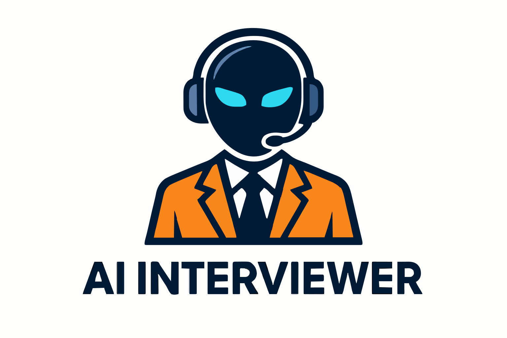
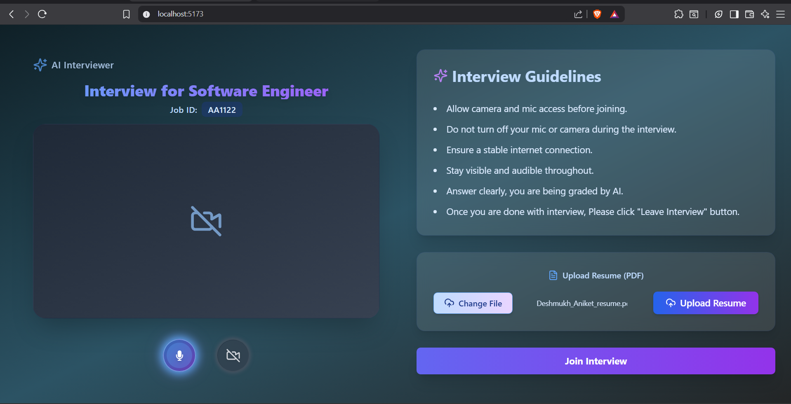
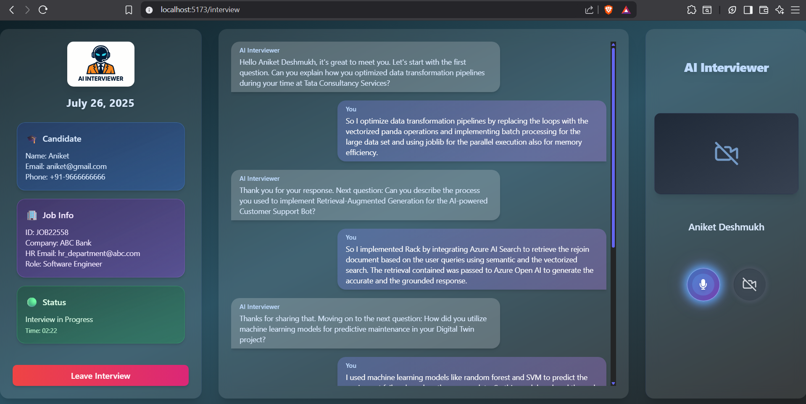
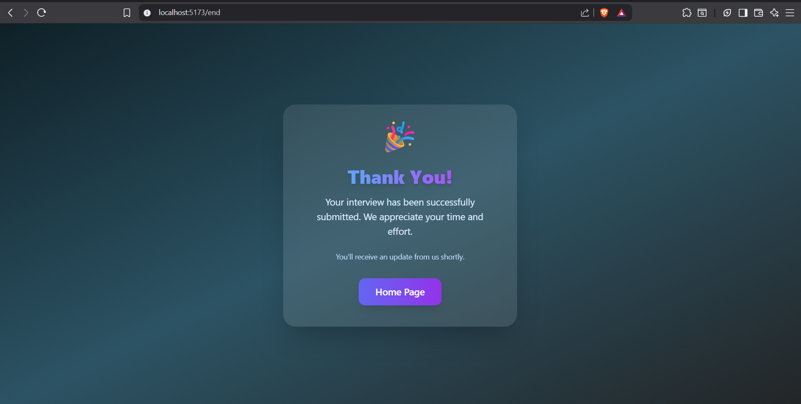

<!-- Banner -->
<p align="center">
  
</p>

# AI Interviewer

[](LICENSE)
[](https://react.dev/)
[](https://fastapi.tiangolo.com/)
[](https://azure.microsoft.com/)


[](CONTRIBUTING.md)

---

## Table of Contents

- [Overview](#overview)
- [Features](#-features)
- [Technology Stack](#-technology-stack)
- [Project Structure](#-project-structure)
- [Quick Start](#-quick-start)
- [Environment Variables](#-environment-variables)
- [Sample Documents](#-sample-documents)
- [Screenshots](#-screenshots)
- [For Developers](#-for-developers)
- [Contributing](#-contributing)
- [License](#-license)

---

## Overview

**AI Interviewer** is a next-generation, AI-powered technical interview platform for seamless, real-time interview experiences. It features advanced resume parsing, natural conversational flow, and a visually stunning, glassmorphic user interface. The platform leverages state-of-the-art AI and cloud technologies to provide a modern, interactive, and fair interview process for both candidates and organizations.

---

## ✨ Features

- **AI-Driven Technical Interviews:** Dynamic, conversational interviews powered by advanced AI models.
- **Resume Upload & Parsing:** Upload your PDF resume for instant parsing and personalized interview questions.
- **Real-Time Audio & Video:** Smooth, low-latency video and voice with modern controls and visual feedback.
- **Azure Speech-to-Text & Text-to-Speech:** Uses Azure Cognitive Services for highly accurate, real-time speech recognition and natural-sounding voice responses.
- **Live Chat & Transcripts:** All interactions are recorded and available for review.
- **Elegant, Responsive UI:** Beautiful, glassmorphic design with gradients and modern effects.
- **Status & Timer:** Monitor your interview status and elapsed time at a glance.
- **Secure & Scalable:** Built with best practices for security and scalability.
- **Azure Storage Integration:** Interview documents are securely uploaded to Azure Storage after each session.

---

## 🖥️ Technology Stack

- **Frontend:** React, Tailwind CSS, Vite
- **Backend:** FastAPI (Python), WebSockets
- **AI/ML:** Azure Form Recognizer (resume parsing), OpenAI (interview logic)
- **Speech:** Azure Speech-to-Text & Text-to-Speech (Cognitive Services)
- **Cloud:** Azure Storage, Azure Cognitive Services

---

## 📁 Project Structure

```
ai-interviewer/
├── ai-frontend/         # React frontend (Vite, Tailwind)
├── backend/             # FastAPI backend, resume parser, interview engine
├── sample-documents/    # (Optional) Sample resumes, transcripts, reports (no real user data)
├── .env.example         # Example environment variables
├── README.md            # Project documentation
├── requirements.txt     # Backend dependencies
└── .gitignore           # Git ignore rules
```

---

## 🚀 Quick Start

```sh
git clone https://github.com/aniketddeshmukh/ai-interviewer.git
cd ai-interviewer
cp .env.example .env  # Add your credentials
cd backend
pip install -r ../requirements.txt
uvicorn websocket_server:app --reload
# In a new terminal:
cd ../ai-frontend
npm install
npm run dev
```

Visit [http://localhost:5173](http://localhost:5173)

---

## 🔐 Environment Variables

All sensitive keys and endpoints are managed via environment variables. See `.env.example` for required variables:

```
SPEECH_KEY=your_azure_speech_key
SPEECH_REGION=your_azure_speech_region
OPENAI_KEY=your_openai_key
OPENAI_DEPLOYMENT=your_openai_deployment
OPENAI_ENDPOINT=your_openai_endpoint
AZURE_DOC_KEY=your_azure_doc_key
AZURE_DOC_ENDPOINT=your_azure_doc_endpoint
AZURE_STORAGE_KEY=your_azure_storage_key
AZURE_STORAGE_CONNECTION_STRING=your_azure_storage_connection_string
AZURE_CONTAINER_NAME=your_azure_container_name
```

---

## 📦 Sample Documents

- The `sample-documents/` folder contains example resumes, transcripts, and reports for development and testing.
- **Real interview documents are uploaded to Azure Storage and are NOT stored in this repository.**

---

## 📸 Screenshots

| Home Page                                               | Interview Page                                | End Page                                |
| ------------------------------------------------------- | --------------------------------------------- | --------------------------------------- |
|  |  |  |

---

## 🧑‍💻 For Developers

- All UI is built with React and Tailwind CSS.
- Backend endpoints are located in `backend/websocket_server.py` and `backend/interview_engine.py`.
- Resume parsing logic is in `backend/resume_parser.py`.
- Azure Speech-to-Text and Text-to-Speech logic is in `backend/interview_engine.py`.
- Customize interview logic or AI model in `interview_engine.py`.
- Update UI themes in `tailwind.config.js`.
- Add or update sample files in `sample-documents/` as needed for testing.

---

## 🤝 Contributing

Contributions are welcome! Please open an issue or submit a pull request for any improvements or suggestions.

---

## 📄 License

This project is licensed under the MIT License.
